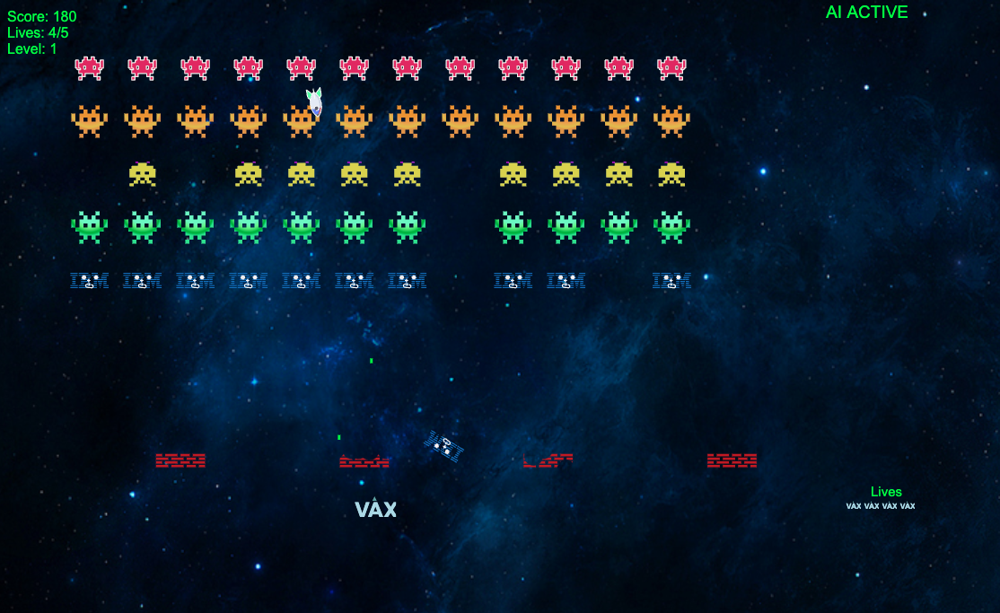

eyeBMinvaders
=============

A Namco-like space invaders game for the mainframe, and any other computers out there. Features an AI mode powered by a neural network trained via Deep Q-Learning, and an in-browser PPO learning system via Rust + WebAssembly.

Plays best on Chrome browsers because Safari sucks in JS performance.

Game features several innovations over the original Space Invaders. Play to find out more!

The original code from NAMCO is [here](https://computerarcheology.com/Arcade/SpaceInvaders/Code.html)



## Quick Start

```bash
python3 serve.py
```
Open http://localhost:8080 in Chrome.

### Controls

| Key | Action |
|-----|--------|
| Arrow keys / A, D | Move |
| Space | Fire |
| 0 | Toggle DQN AI mode |
| W | Toggle PPO observation (records gameplay) |
| T | PPO training dashboard (trains in background) |
| E | Export recorded gameplay / PPO weights |
| P | Pause |
| R | Restart |
| M | Mute |

## WASM Physics Engine (Zero Sim-to-Real Gap)

The game runs on a Rust physics engine compiled to WebAssembly. The same `game_sim_core` crate compiles to:
- **WASM** (browser gameplay) — `wasm_agent/`
- **Native** (GPU training via PyO3) — `game_sim/`

This eliminates the sim-to-real gap: what the model trains on is exactly what it plays against.

### Building WASM

```bash
cd wasm_agent && bash build.sh
```

Requires `wasm-pack` (auto-installed by build.sh). Produces `wasm_agent/pkg/` with a ~260KB WASM binary.

### How It Works

```
game_sim_core (Rust)
    ├── compiles to WASM → browser game physics (wasm_game.js loads it)
    ├── compiles to native → GPU training (PyO3, train.py uses it)
    └── same constants, same collision, same movement, same reward
```

When WASM is available, `game.js` uses `WasmGame.tick()` for all physics. If WASM fails to load, it falls back to the legacy JS physics seamlessly.

## AI Modes

### DQN AI (press 0)
Loads `models/model_weights.json` and runs inference in JS. The model was trained on identical WASM physics via the Rust sim.

### PPO In-Browser Learning (press T)
A PPO agent built in Rust/WASM trains directly in the browser on the same `game_sim_core` physics. Press T to see the training dashboard with live stats (episodes, avg reward, kills, entropy, reward sparkline).

### Recording Gameplay (press W)
Records your state/action/reward transitions at 30Hz. Auto-saves to `models/gameplay_data.jsonl` via the backend (`serve.py`). Use for behavioral cloning.

## AI Training

### Requirements

```bash
pip install torch numpy
# For Rust sim:
cd game_sim && maturin develop --release
```

### Train a model

```bash
python3 train.py --episodes 500000
```

The Rust sim auto-scales based on GPU memory (2048 envs + batch 4096 on 24GB+ VRAM).

### Resume from checkpoint

```bash
python3 train.py --resume models/model_best.pt --episodes 200000
```

### Export model for browser play

```bash
python3 export_model.py models/model_best.pt
```

### Training options

| Flag | Default | Description |
|------|---------|-------------|
| `--episodes N` | 1,000,000 | Number of episodes to train |
| `--resume PATH` | — | Resume from checkpoint |
| `--device DEVICE` | auto | Force `cpu`, `cuda`, or `mps` |
| `--num-envs N` | auto | Parallel game environments |
| `--god-mode` | off | Hits penalized but no death (avoidance training) |

## Architecture

### Core Game Simulation (`game_sim_core/`)
Pure Rust library — the single source of truth for all game mechanics. No FFI dependencies. Compiles to both native and WASM targets.

### Files

| File | Purpose |
|------|---------|
| `game.js` | Rendering, input, sound, UI. Uses WASM physics when available, legacy JS fallback. |
| `wasm_game.js` | Loads WasmGame from WASM, bridges tick() results to JS globals for rendering |
| `wasm_bridge.js` | PPO agent bridge: observation recording, turbo training, training dashboard |
| `serve.py` | Game HTTP server + POST /api/gameplay endpoint for recording |
| `game_sim_core/` | Pure Rust game simulation (shared between WASM and native) |
| `game_sim/` | PyO3 wrapper for Python training (synced from game_sim_core) |
| `wasm_agent/` | WASM PPO agent + WasmGame physics engine |
| `train.py` | DQN training with Dueling DQN, NoisyNet, N-step, frame stacking |
| `meta_train.py` | Meta-learning with plateau detection and hyperparameter evolution |
| `export_model.py` | PyTorch → JSON model converter |
| `headless/` | Node.js headless game runner for testing models against real JS game |

### DQN Architecture

| Component | Details |
|-----------|---------|
| Network | Dueling DQN (shared 512→256 features → Value + Advantage streams) |
| Exploration | NoisyNet (factorized, sigma=0.5) + epsilon-greedy fallback |
| State | 50 features × 4 frame stack = 200 inputs |
| Returns | N-step (n=5) with gamma=0.99 |
| Replay | Dual-buffer: uniform (2M) + important transitions (100K) |
| Parallelism | Rayon-parallelized Rust sim, 2048 envs on GPU |

### PPO Architecture (WASM)

| Component | Details |
|-----------|---------|
| Network | Actor-Critic (shared 256→128 → policy head + value head) |
| Training | Clipped surrogate + GAE-lambda + entropy bonus |
| Rollout | 2048 steps per update, 4 epochs, 64 minibatch |
| Features | Observation normalization, reward normalization, LR scheduling |
| Curriculum | Auto-advances starting level when avg reward exceeds threshold |

### Training Results (Latest — Zero Gap)

| Metric | Value |
|--------|-------|
| Best Level | 8 |
| Best Score | 138,730 |
| Peak Avg Score | 74,105 |
| Peak Avg Level | 4.6 |
| Training Speed | 30-60 ep/s (RTX 5090) |
| Sim-to-Real Gap | **Zero** (same Rust binary) |

March, 2025
