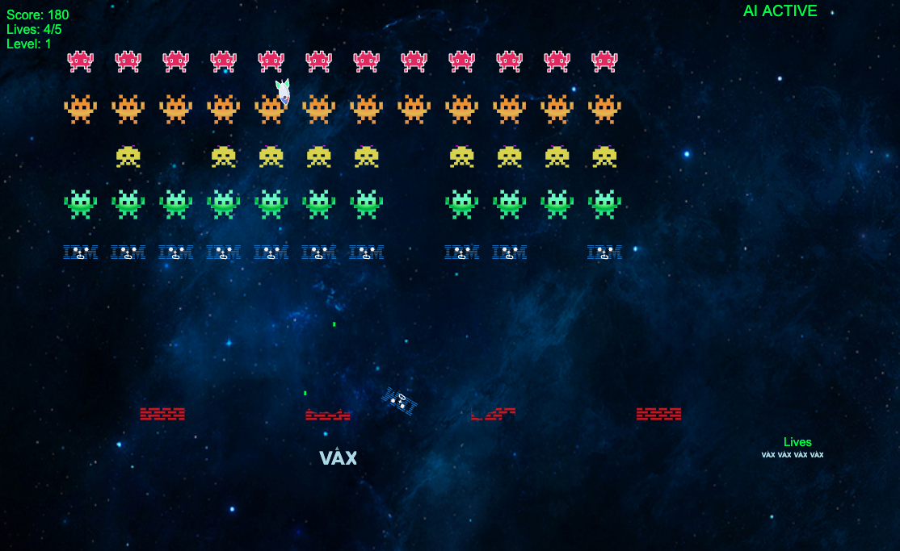

eyeBMinvaders
=============    

A space invaders game for the mainframe, and any other computers out there. All it needs is a simple webserver like python3 -m http.server

Plays best on Chrome browsers because Safari sucks in JS performance. 

Game faeatures several innovation over the original Space Invaders. Play to find out more!

The original code from NAMCO is [here](https://computerarcheology.com/Arcade/SpaceInvaders/Code.html) 

February, 2025   

